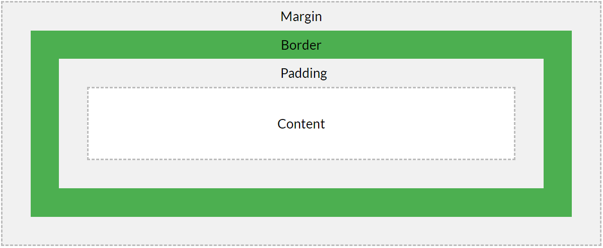

[TOC]
# CSS基础

### CSS样式加载优先级
1. 内联样式（在 HTML 元素内部)
2. 内部样式表（位于 <head> 标签内部)
3. 外部样式表
4. 浏览器缺省设置

### CSS语法
```
selector {
    property1: value1;
    prop2: value2.1, value2.2;
    ...
}
```

### CSS选择器
* #### contextual selector
```
li strong {
    font-style: italic;
    font-weight: normal;
    }
```
表示`li`元素下的`strong`元素的样式

* #### id selector
```
#red {color:red;}
#green {color:green;}
```
`id`为red和green选择器
```
#sidebar p {
    font-style: italic;
    text-align: right;
    margin-top: 0.5em;
    }
```
表示`id`为sidebar中的p元素的样式,此例为id selector和contextual selector
```
div#sidebar {
    border: 1px dotted #000;
    padding: 10px;
    }
```
表示`id`为sidebar的`div`元素, 但是貌似这个div很多余啊, 毕竟id在一个页面中就只能用一次

* #### class selector
```
.center {text-align: center}
```
表示`class`为center的选择器
```
.fancy td {
    color: #f60;
    background: #666;
    }
```
表示`class`为fancy的元素中的`td`元素, 同样的, 为class selector和contextual selector的组合
```
td.fancy {
    color: #f60;
    background: #666;
    }
```
表示`class`为fancy的'td'元素

* #### property selector
```
[title]
{
color:red;
}
```
选择的目标是:包含title属性的所有元素

* #### value selector
```
input[type="text"]
{
  width:150px;
  display:block;
  margin-bottom:10px;
  background-color:yellow;
  font-family: Verdana, Arial;
}
```
选择的目标是:属性type是"text"的input元素

### CSS书写顺序(以盖楼房举例说明)
1. 位置属性: position, top, right, z-index, display, float (找个位置盖楼)
2. 尺寸大小: width, height, padding, margin (规定每栋楼的大小)
3. 背景边框: background, border (架柱子, 上砖, 批灰)
4. 文字内容: font, line-height, letter-spacing, color-text-align (房子的内饰, 摆个画, 放个沙发之类)
5. 其他: animation, transition (后期配套, 如超市, 银行, 医院)

### margin, border, padding, content, width, height, background
1. HTML中的元素可以看成是一个个的盒子, width和height是指content内容的宽度和高度
2. background是指整个padding和content区域的背景图


### display和position属性
position属性包括static, fixed, sticky, relative和absolute五个值.
position中的relative和absolute的比较:
1. relative是针对于该元素在文档流中的正常位置进行定位,
2. absolute是根据祖先类中的position非static元素进行定位的,如果没有非static定位的元素,absolute将相对于html元素定位.

### 伪类???
