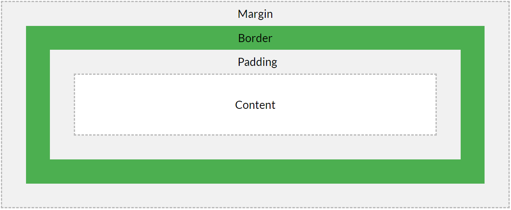

# CSS基础

## CSS样式加载

**加载种类**
* 内联样式(Inline CSS): 在HTML元素styles属性内定义
* 内部样式表(Internal CSS):  位于`<head>`中的`<style>`标签内部定义
* 外部样式表(External CSS): 位于单独的css文件内,并在`<head>`中的`<link>`中引用
* 浏览器缺省设置

**优先级**
使用就近原则，最后加载的样式优先级更高

## CSS语法

```css
selector1 {
    property1: value1;
    prop2: value2.1, value2.2;
    ...
}
selector2 {
    ...
}
```

## CSS选择器

### 一. 基本选择器

#### 1. 元素选择器(element selector)

```css
p {
    ...
}
```

#### 2. ID selector

```css
\* id为red和green选择器 *\
#red {color:red;}
#green {color:green;}

/* 表示`id`为sidebar中的p元素的样式,此例为id selector和descendant selector的结合 */
#sidebar p {
    font-style: italic;
    text-align: right;
    margin-top: 0.5em;
    }

/* 表示id为sidebar的<div>元素, 但是貌似这个div很多余啊, 毕竟id在一个页面中就只能用一次 */
div#sidebar {
    border: 1px dotted #000;
    padding: 10px;
    }
```

#### 3. Class selector

```css
/* 表示`class`为center的选择器*/
.center {text-align: center}

/* 表示`class`为fancy的元素中的`<td>`元素, 同样的, 为class selector和descendant selector的组合*/
.fancy td {
    color: #f60;
    background: #666;
    }

/* 表示`class`为fancy的'td'元素 */
td.fancy {
    color: #f60;
    background: #666;
    }
```
### 二. 结合选择器(Combinator selector)

#### 1. 后代选择器(descendant selector)

使用空格表示:
```css
/* 表示<li>元素下的所有层级的<strong>元素的样式. */
li strong {
    font-style: italic;
    font-weight: normal;
    }
```

#### 2. 子选择器(Child selector)

使用 > 表示:
```css
/* 表示选择<body>元素下的喜爱层级的所有<p>元素 */
body>p {
    background: gray
}
```

#### 3. 相邻弟选择器(Adjacent sibling combinator)

使用+表示(记忆方式 a+b中b相对a的关系):
```css
/* 只选择则目标样式id为target的相邻的下一个p元素. */
#target+p {
    color:red;
    ...
}
```

#### 4. 通用相邻选择器(General sibling combinator)

使用~表示:
```css
/* 表示选择id为target元素的往下所有相邻元素. */
#target~p {
	...
}
```

### 三. 伪类选择器(Pseudo class selector)

使用冒号来表示

 

### 四. 伪元素选择器 (Pseudo element selector)

使用双冒号来表示

 

### 五. 属性选择器(Attribute selectors)

* CSS [attribute] Selector: 选择所有包含属性的元素

* CSS [attribute="value"] Selector: 选择包含该属性且属性值和"value"完全相等的元素

* CSS [attribute~="value"] Selector: 选择包含该属性, 且属性值包含整词"value"的元素

* CSS [attribute|="value"] Selector: 选择包含该属性, 且属性值以整词"value", 或以"value-"开头的元素

* CSS [attribute^="value"] Selector: 选择包含该属性, 且属性以"value"开头的元素

* CSS [attribute$="value"] Selector: 选择包含属性, 且属性以"value"结尾的元素

* CSS [attribute*="value"] Selector: 选择包含属性, 且属性中包含"value"的元素

```css
/* 选择包含title属性的所有元素*/
[title]{
    color:red;
}

/* 选择包含target属性的所有<a>元素*/
a[target]{
    ...
}

/* 选择target为"_blank"的所有<a>元素 */
a[target="_blank"]{
    ...
}

/* 选择有title属性, 并属性值包含整词"flower"的的元素 */
[title~="flower"] {
  border: 5px solid yellow;
}

/* 选择有class属性, 并属性值以整词"top"开头, 当以"top-"开头时, 也可以选中该元素 */
[class|="top"] {
  background: yellow;
}

/* 选择有class属性, 并属性以"top"开头, 不必是整词 */
[class^="top"] {
  background: yellow;
}

/* 选择有class属性, 并属性以"test"结尾, 不必是整词 */
[class$="test"] {
  background: yellow;
}

/* 选择有class属性, 并且属性值中包含"te", 不必是整词 */
[class*="te"] {
  background: yellow;
}

/* 选中包含title属性, 并且class属性以genes结尾的<a>元素 */
a[title][class$="genes"]
```
## CSS书写顺序(以盖楼房举例说明)

1. 位置属性: position, top, right, z-index, display, float (找个位置盖楼)
2. 尺寸大小: width, height, padding, margin (规定每栋楼的大小)
3. 背景边框: background, border (架柱子, 上砖, 批灰)
4. 文字内容: font, line-height, letter-spacing, color-text-align (房子的内饰, 摆个画, 放个沙发之类)
5. 其他: animation, transition (后期配套, 如超市, 银行, 医院)

## margin, border, padding, content, width, height, background

1. HTML中的元素可以看成是一个个的盒子, width和height是指content内容的宽度和高度
2. background是指整个padding和content区域的背景图


## display和position属性

position属性包括static, fixed, sticky, relative和absolute五个值.
position中的relative和absolute的比较:
1. relative是针对于该元素在文档流中的正常位置进行定位,
2. absolute是根据祖先类中的position非static元素进行定位的,如果没有非static定位的元素,absolute将相对于html元素定位.

## 伪类
