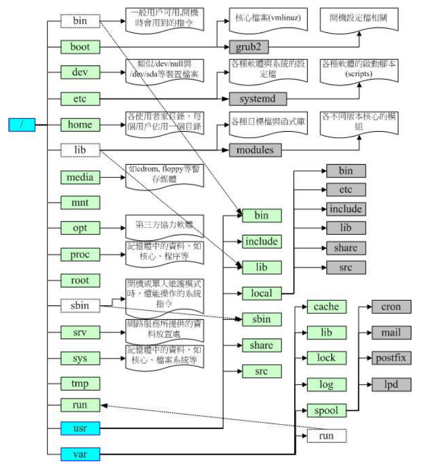
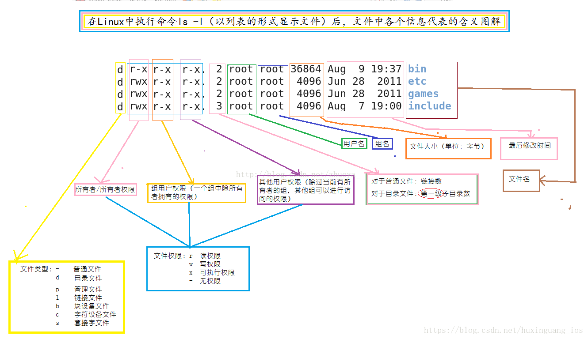

# linux学习笔记

## 开源操作系统


## linux基础知识

* 硬件知识
* 安装linux操作系统
* 了解linux的基本概念, 如用户管理, 权限管理, 文件管理, 运行程序管理.
* 使用vim编辑器
* Shell与ShellScript学习
* 安装软件,例如使用PM/DPKG/YUM/APT安装, 使用解压缩的方式安装, 使用编译源码的方式安装
* 网络基础

## 安装linux

### 磁盘分区与挂载

MBR和GPT分区模式
主分区和逻辑分区

## 用户管理

新建用户, 设置密码, 切换用户

```shell
useradd -m username #创建用户,并在home目录底下创建username的工作目录
passwd username #设置密码后, username账户才能激活
su - username #加上-之后, 会自动切换到username的工作目录

```

如果要添加sudo权限, 则可以修改sudoers文件

```shell
vi /etc/sudoers
```

在该文件中添加

```shell
username ALL=(ALL:ALL) ALL
```

用户信息放在/etc/passwd内, 个人密码记录在/etc/shadow中, linux组名记录在/etc/group中

使用文件拥有者, 群组, 其他人三个类别来设置权限.

## 文件目录结构

linux/unix下的哲学核心思想是:`一切皆文件`.
> In Linux, everything is a File

linux使用FHS(File Hierarchy Standard)来约束各目录存放什么类型的文件



使用一下命令来切换目录:

```shell
cd                  # 回到家目录
cd ~                # 回到家目录
cd ~username        # 回到用户username的家目录
cd -                # 回到刚刚的目录
```

## 文件权限管理

使用 `ls -l`来查看文件的属性, 如下图所示



同过如下命令来修改文件属性来管理权限

* chown 修改文件拥有者
* chgrp 修改文件所属群组
* chmod 修改文件rwx权限

## 压缩解压缩

tar本身是个打包工具, 使用参数-c来创建tarball文件. 
使用参数-z来使用gzip压缩算法, 使用-j来使用bzip2压缩算法, 使用-J来使用xz压缩算法.
其中-f参数是必须的, 来指定压缩或解压缩的文件.

```shell
tar -zxvf finename  -C dirname                 # 解压gz文件dirname目录下
tar -jxvf finename  -C dirname                 # 解压bzip2文件
tar -Jxvf filename  -C dirname                 # 解压xz文件
tar -zcvf filename [file1, file2, dir1, dir2]  # 创建gz压缩文件
tar -jcvf filename [file1, file2, dir1, dir2]  # 创建bzip2压缩文件
tar -Jcvf filename [file1, file2, dir1, dir2]  # 创建xz压缩文件
tar -tvf filename                              # 列表显示压缩文件中的内容
```

## Shell

人机交互的工具, 狭义的shell特指命令行, 广义的shell包括桌面系统.

### 变量与环境变量

### shell环境配置加载

### 通配符与特殊符号

### 数据流重导向

### 管线
