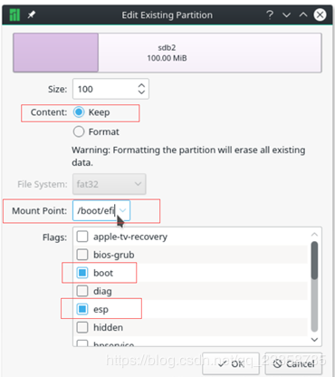

# 安装win10和manjaro双系统
1. 确认硬盘分区是GPT模式,而不是MBR模式,可以使用DiskGenious进行转换,创建一个分区(格式NTFS)给win10,创建一个分区(格式ext4)给manjaro,创建一个分区(fat16/fat32)给UEFI启动;
2. 先使用rufus制作win10启动盘,安装win10系统;
3. 再使用rufus制作manjaro启动盘,安装manjaro系统,安装时注意,选择安装manjaro的分区,mountpoint为"/",选择安装UEFI的分区,mountpoint为"/boot/efi",flag为boot,esp

 

4. 重启后如果系统还是默认进入win10, 需要替换引导文件, 用管理员启动powershell, 输入`bcdedit /set '{bootmgr}' path \EFI\Manjaro\grubx64.efi`. 提示操作成功的话，就完成了。
5. 再次重启电脑发现默认进入manjaro,我们需要设置下grub启动的配置,输入`sudo vim /etc/default/grub`,将`GRUB_HIDDEN_TIMEOUT_QUIET`设置为false,`GRUB_DEFAULT=0`中的0修改为2
修改完毕后输入`sudo update-grub`.

参考链接:

https://www.jianshu.com/p/5007e555ec12

http://dejary.top/2019/01/23/Manjaro%E8%B8%A9%E5%9D%91%E8%AE%B0%E5%BD%95/

