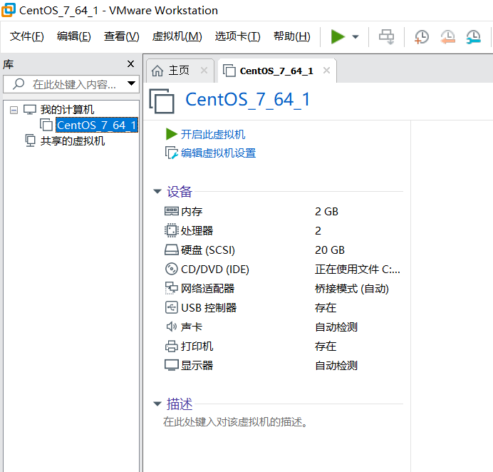
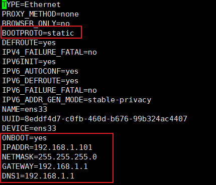
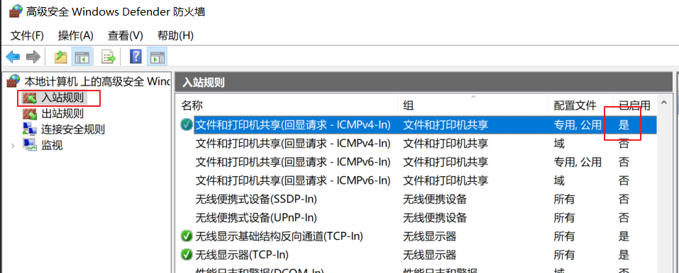

# 使用vmware安装虚拟机

## 1. 准备工作

* 安装VMware Workstation Pro软件
* 下载centos7的镜像文件(下载centos7是因为它体积比版本8小得多)

## 2. 安装虚拟机

虚拟机使用的配置如下所示, 注意网卡的设置, 要使用**桥接模式**. 这几种网卡模式的区别是:
* 桥接模式: 直接使用宿主机的网卡进行联网, 和宿主机处在同一个网段
* NAT模式: 创建一个虚拟的局域网, 和宿主机处在不同的网段, 直接通过宿主机来联网, 缺点是局域网内其它机器不能访问此虚拟机
* 主机模式: 使用此模式, 虚拟机不能访问外网

 

## 3. 为虚拟机配置静态IP地址

使用以下命令编辑虚拟机网卡设置, 注意文件ifcfg-ens33中的ens33是网卡的名称, 不同的机器, 网卡名称可能会不一样.

```shell
vi /etc/sysconfig/network-scripts/ifcfg-ens33
```

配置中需要改动的地方如下图红色标记处所示, 注意IP地址要与宿主机在同一个网段且没有占用, 网关与DNS服务器的地址均与宿主机保持一致.

 

编译完成后, 使用以下命令重启网络服务

```shell
systemctl restart network.service
```

## 4. 测试

* 使用虚拟机ping宿主机
* 使用虚拟机ping外网地址
* 使用宿主机ping虚拟机

## FAQ
有时候主机ping不通虚拟机是因为主机的windows防火墙的原因, 参考如下配置:

 

## 参考
🐏哥的教程: <https://mp.weixin.qq.com/s/onVwwEQ1DAwbvK7qS2YNxg>
