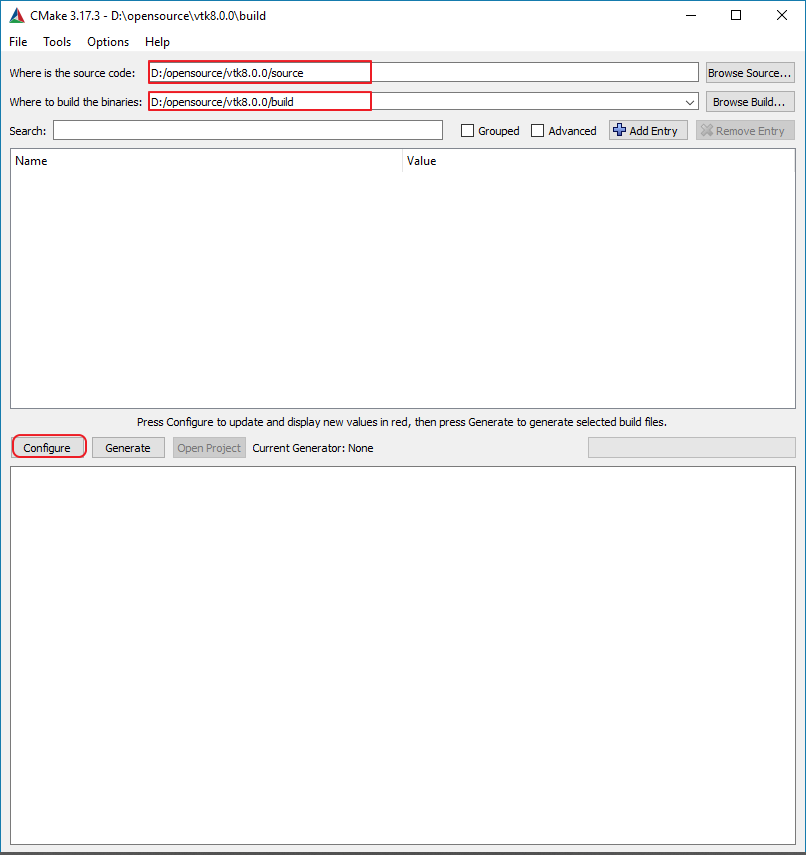
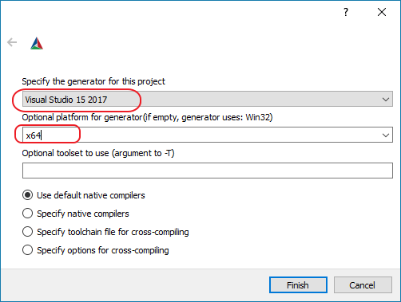
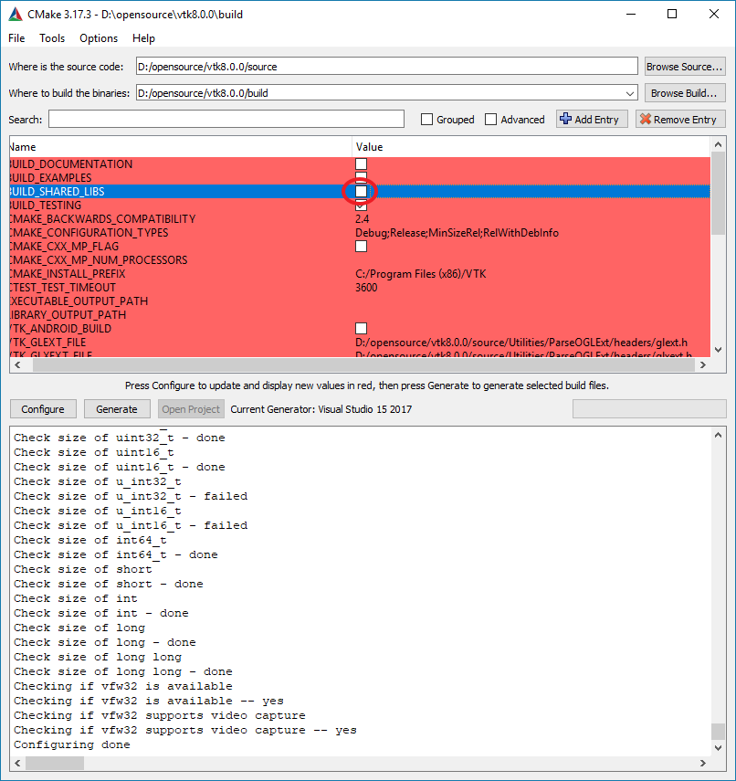
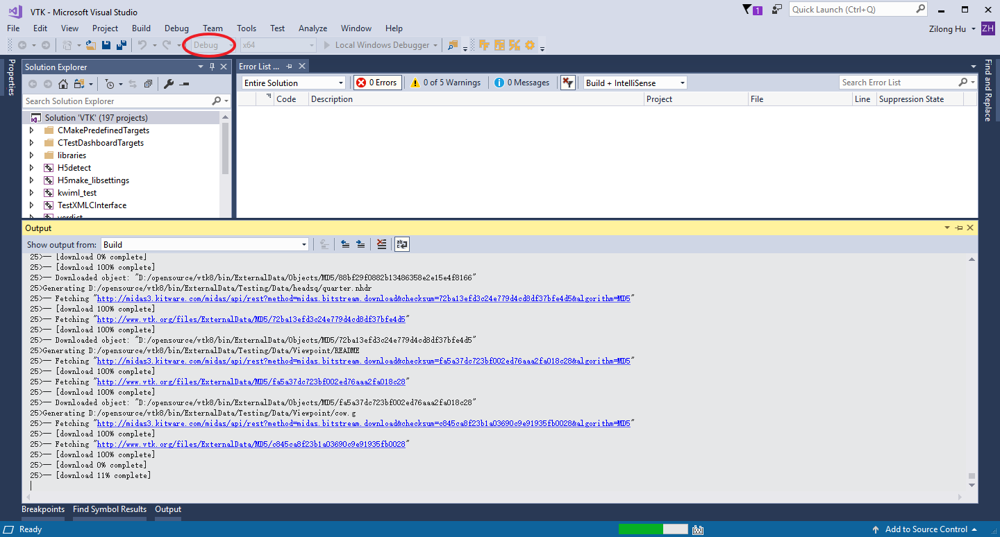
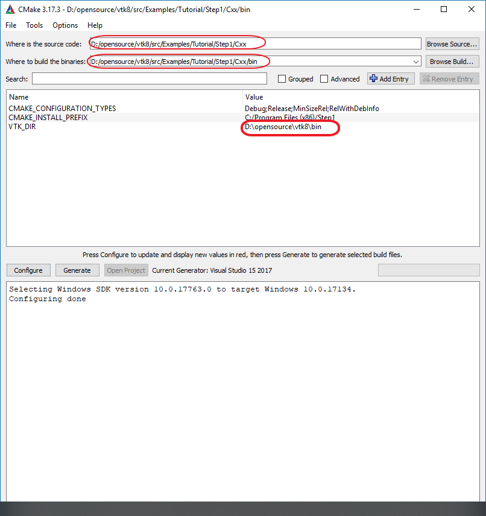

# VTK学习笔记

## 安装

### 1. 准备

本教程的环境为win10, 安装了git, cmake和visual studio 2017.

### 2. 使用以下命令下载源代码

```shell
git clone --branch v8.0.0 https://gitlab.kitware.com/vtk/vtk.git --depth=1
```

### 3. 使用CMake-GUI进行配置

选择源代码路径, 选择编译输出路径, 点击config


点击config后弹出对话框, 选择编译器为visual studio, 选择编译环境为x64


等待一分钟, 会弹出设置变量的界面, 这里取消编译动态链接库的选项, 使编译为静态库, 因为静态库更方便使用

变量设置完了后然后再次点击config, 然后点击 Generate, 再点击Open Project.

### 4. 在Visual Studio中编译

在CMake中点击完OpenProject后, Visual Studio就会启动, 在Visual Studio中可以选择编译Debug版本或Release版本, 然后编译整个solution. Wait several hours...


## How to run example

1. Open CMake-GUI.
2. Fill the source code path(i.e. VTK_SOURCE_CODE/Examples/Tutorial/Step1/Cxx) and output path.
3. Click `Configure`. Select compiler and platform type which should be same with one when you compile vtk library.
4. Fill the variable of `VTK_DIR` which is your vtk output location when compiling vtk library.


5. Click `Configure` to finish configuration and click `Generate` and `Open Project`.
6. Build and run in the Visual Studio.

## 代码介绍

### Low level object model

几乎所有的vtk对象都继承这个类vtkObject, 使用vtkObject::New()和vtkObject::Delete()来创建和销毁对象.

对象都创建在堆中, 因为vtk不允许调用构造函数(protected).

vtk中使用vtkObject::Register()和vtkObject::UnRegister()来增加和减少引用计数. 下面代码中调用SetExample()会增加obj对象的有引用计数.

```cpp
vtkObjectBase* obj = vtkExampleClass::New();
otherObject->SetExample(obj);
obj->Delete();
```

使用vtkSmartPointer可以不用手动调用Delete函数.

```cpp
vtkSmartPointer<vtkObjectBase> obj =
vtkSmartPointer<vtkExampleClass>::New();
```

### Rendering Engine

* **vtkProp**.场景中存在的数据的可见描绘由vtkProp的子类表示。 经常使用的子类有, 3D 中使用vtkActor和vtkVolumn(描绘3D位置,方向,比例), 2D中使用vtkActor2D(2D位置, 高度, 宽度).

* vtkAbstractMapper. props generally have a mapper object(vtkAbstractMapper) that holds the data and knows how to render it
  
* **vtkProperty** and **vtkVolumeProperty**. props generally have a a property(vtkProperty and vtkVolumeProperty) object that controls parameters such as color and opacity.
  
* **vtkCamera**.

* **vtkLight**.

* **vtkRenderer**. The objects that make up a scene including the props, the camera and the lights are collected together in a vtkRenderer. The vtkRenderer is responsible for managing the rendering process for the scene. Multiple vtkRenderer objects can be used together in a single vtkRenderWindow. These renderers may render into different rectangular regions (known as viewports) of the render window,or may be overlapping.

* **vtkRenderWindow**. The vtkRenderWindow provides a connection between the operating system and the VTK rendering engine.

* **vtkRenderWindowInteractor**. The vtkRenderWindowInteractor is responsible for processing mouse, key, and timer events and routing these through VTK's implementation of the command /observer design pattern.

* **vtkTransform**. Many of the objects in the scene that require placement such as props, lights, and cameras have a vtkTransform parameter that can be used to easily manipulate the position and orientation of the object.

### The Visualization Pipeline